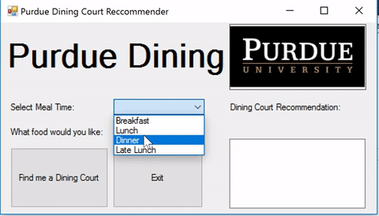

# DiningCourtApp
Windows application that recommends a dining court to eat at!

## Features

* Uses Purdue's Dining Court API to grab latest dining court information
* Recommendsa dining court based on foods the user selects
* Does recomendations for specific meal times
* Displays full menu for the meal time of the recommended dining court

## Preview

